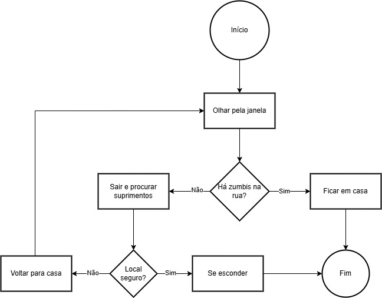

# Sequenciamento de Ideias e Fluxogramas

## 1️ - Introdução

Imagine que você está no meio de um **apocalipse zumbi**! 🧟‍♂️ Seu objetivo principal é **sobreviver** e encontrar um lugar seguro. Mas, sem um plano bem estruturado, as chances de erro são altas… e um erro aqui pode significar virar comida de zumbi! 🍖  

>❓Se você acordasse agora e descobrisse que o mundo está tomado por zumbis, **qual seria sua primeira ação?** "correr", "pegar comida", "procurar abrigo"...  

💡 **Moral da história:**  
Tomar decisões de forma caótica pode **te levar direto para os braços dos zumbis**. Para sobreviver, precisamos de um **plano estruturado**, seguindo um passo a passo. E é exatamente isso que os algoritmos fazem!

## 2 - Sequenciamento de Ideias  

O **sequenciamento de ideias** é a habilidade de organizar uma série de ações na **ordem correta**, garantindo que cada passo seja lógico e eficiente.  

**⚠️ Problema:**  
Se você inverter os passos, pode ter sérios problemas! Imagine tentar cozinhar sem antes acender o fogo… ou pior, sair correndo para a rua sem verificar se há zumbis!  

### Sequência Errada vs. Sequência Correta
🚫 **Errado:**  
1. Sair correndo desesperado.  
2. Procurar abrigo.  
3. Tentar encontrar comida.  
4. Verificar se o local é seguro.  

✅ **Correto:**  
1. **Analisar a situação** (onde estou? há zumbis por perto?).  
2. **Buscar recursos essenciais** (comida, água, armas).  
3. **Procurar um local seguro**.  
4. **Verificar a segurança do abrigo** antes de entrar.  
5. **Planejar os próximos passos**.  

💡 **Conclusão:**  
Na programação, os computadores **executam exatamente o que mandamos**, na ordem que mandamos. Assim como na sobrevivência, um erro na sequência pode levar ao fracasso!  

## 3 - Fluxogramas – Transformando Planos em Diagramas

Agora que entendemos a importância do **sequenciamento**, podemos representar esses passos visualmente com **fluxogramas**.  

Um fluxograma é um **diagrama visual** que representa um processo ou algoritmo por meio de símbolos conectados por setas.  

### Principais Símbolos

| **Símbolo** | **Significado** | **Exemplo** |
|------------|---------------|------------|
| ⚪ **Oval** | Início/Fim | "Início" ou "Fim" do processo |
| 🟩 **Retângulo** | Ação/Processo | "Pegar comida" |
| 🔹 **Losango** | Decisão (Sim/Não) | "Há zumbis na rua?" |

---

## 4 - Criando Nosso Primeiro Fluxograma  

**📖 Situação:**  
Você está em casa e precisa decidir **se sai para buscar suprimentos** ou **se permanece no abrigo**.  

**Fluxograma Representando a Decisão:**  

**Explicação:**  
- **Se houver zumbis na rua**, ficamos em casa.  
- **Se a rua estiver segura**, saímos para buscar suprimentos.  
- **Se encontrarmos um local seguro**, podemos nos esconder lá.  
- **Se não houver segurança**, voltamos para casa.  

📌 **Moral da história:**  
Esse fluxograma representa um **algoritmo de decisão**, estruturado de maneira lógica.  

## 5 - Desafio Prático – Criando Seu Próprio Fluxograma

Ferramenta para criar fluxogramas:  
[Draw.io](https://app.diagrams.net/)  
[Lucidchart](https://www.lucidchart.com/pages/pt)

Agora você precisa decidir **como agir ao encontrar um sobrevivente desconhecido**.  
Crie um **fluxograma com pelo menos 3 decisões**, garantindo que o processo seja **lógico e estruturado**.  

1. **Ele parece amigável ou perigoso?**  
2. **Se amigável, ele pode se juntar ao grupo?**  
3. **Se perigoso, o que fazer?**  
