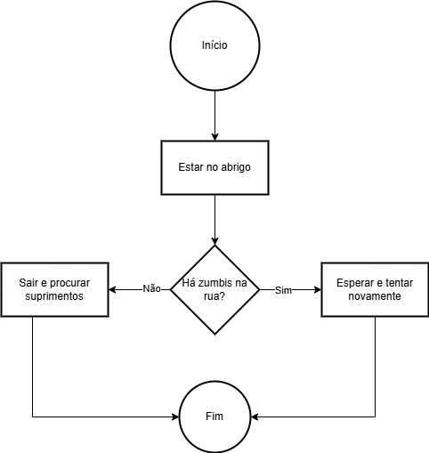
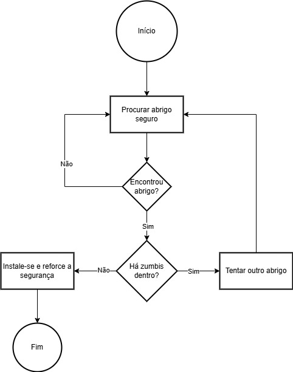
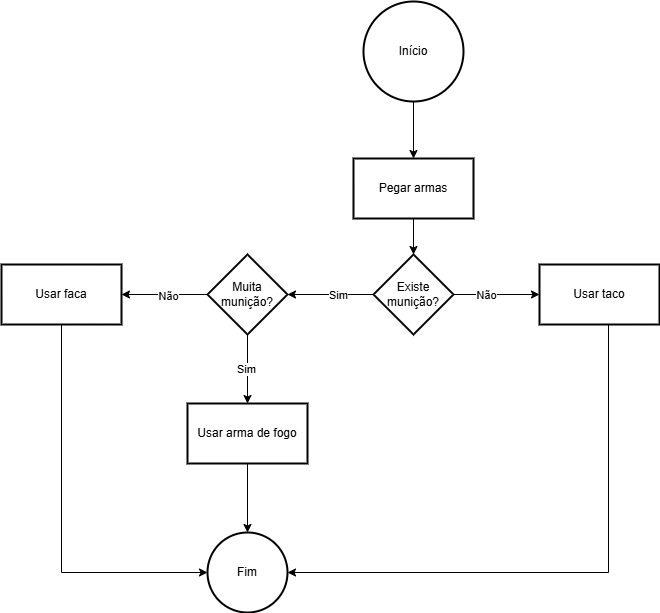

# Exercícios

## Exercício 1 – Pegando suprimentos com segurança 
Você precisa sair do abrigo para buscar suprimentos. Antes de sair, deve verificar se há zumbis na rua. Caso haja, espere e tente novamente mais tarde. Se a rua estiver segura, vá buscar os suprimentos e volte rapidamente.  



```shell
algoritmo "buscar_suprimentos"
var
   rua_segura: logico
inicio
   escreval("A rua está segura? (VERDADEIRO ou FALSO?)")
   leia(rua_segura)

   enquanto (rua_segura = falso) faca
      escreval("Está perigoso, espere e tente novamente... ")
      escreval("A rua está segura agora? (VERDADEIRO ou FALSO?)")
      leia(rua_segura)
   fimenquanto

   escreval("Saindo para buscar suprimentos!")
   escreval("Pegou os suprimentos e voltou para casa em segurança.")
fimalgoritmo
```

## Exercício 2 – Encontrando um abrigo seguro  
Você precisa procurar um abrigo seguro. Se encontrar um lugar, verifique se há zumbis dentro. Se houver, tente outro abrigo. Se não houver, instale-se e reforce a segurança.  



```shell
algoritmo "encontrar_abrigo"
var
   abrigo_encontrado, abrigo_seguro: logico
inicio
   abrigo_encontrado <- falso
   abrigo_seguro <- falso

   enquanto (abrigo_encontrado = falso) faca
      escreva("Encontrou um abrigo? (VERDADEIRO OU FALSO?)")
      leia(abrigo_encontrado)
   fimenquanto

   escreva("Verificando segurança do abrigo...")
   escreva("O abrigo está livre de zumbis? (VERDADEIRO OU FALSO?)")
   leia(abrigo_seguro)

   se (abrigo_seguro) entao
      escreva("Abrigo seguro! Reforçando as defesas...")
   senao
      escreva("Abrigo perigoso! Procurando outro lugar...")
   fimse
fimalgoritmo
```

## Exercício 3 – Escolhendo uma arma adequada
Você encontrou algumas armas: **faca, taco de beisebol e arma de fogo**. Se tiver **muita munição**, use a arma de fogo. Se tiver **pouca**, prefira a faca para economizar. Caso não haja munição, use o taco de beisebol.  



```shell
algoritmo "escolher_arma"
var
   municao: inteiro
inicio
   escreva("Quantas balas você tem? ")
   leia(municao)

   se (municao > 10) entao
      escreva("Use a arma de fogo!")
   senao
      se (municao > 0) entao
         escreva("Use a faca para economizar munição!")
      senao
         escreva("Use o taco de beisebol!")
      fimse
   fimse
fimalgoritmo
```